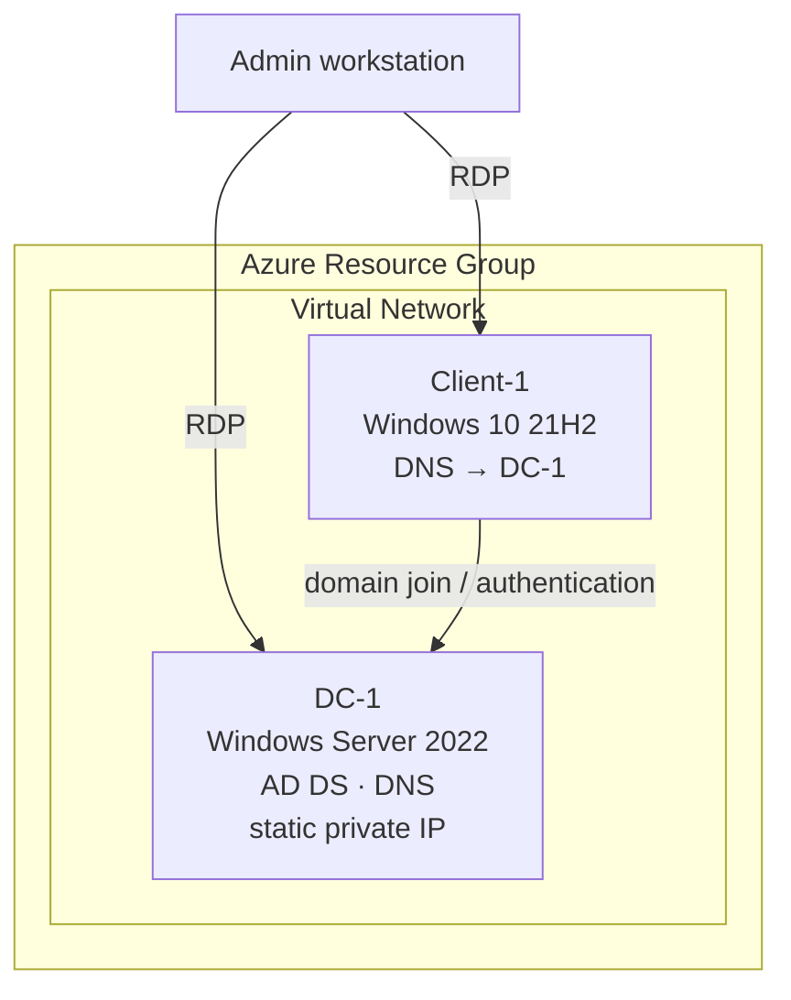

# On-premises Active Directory Deployed in the Cloud (Azure)

This walkthrough covers deploying an on-premises-style Active Directory environment inside Azure Virtual Machines: provisioning a domain controller and a client VM, standing up Active Directory Domain Services, joining the client to the domain, and managing users and groups.

## Environments and Technologies Used

- Microsoft Azure (Virtual Machines / Compute, Virtual Network)
- Remote Desktop (RDP)
- Active Directory Domain Services (AD DS)
- PowerShell

## Operating Systems Used

- Windows Server 2022 (domain controller)
- Windows 10 21H2 (client)

## Lab Topology

Both VMs live in the same Azure Virtual Network. The domain controller gets a static private IP, and the client uses the DC as its DNS server so it can find and join the domain.

## High-Level Deployment and Configuration Steps

1. **Provision virtual machines** — create a Windows Server 2022 VM (the future domain controller) and a Windows 10 VM (the client) in the same virtual network.
2. **Install and configure Active Directory** — install the AD DS role on the server and promote it to a domain controller.
3. **Join the client to the domain** — point the client's DNS at the domain controller and join it to the new domain.
4. **Create users and groups** — set up user accounts and organize them into groups for resource management and security.

## Deployment and Configuration Steps

### 1. Provision Azure Virtual Machines

Create two VMs in the same Azure Virtual Network:

- **DC-1** — Windows Server 2022. Set its private IP address to **static** (a domain controller's address must not change), and disable the Windows Firewall temporarily for connectivity testing.
- **Client-1** — Windows 10 21H2. In its network settings, set the **DNS server to DC-1's private IP** so the client can resolve the domain.

Verify connectivity by pinging DC-1 from Client-1 over RDP before moving on.

### 2. Install Active Directory Domain Services

On DC-1, use Server Manager to add the **Active Directory Domain Services** role, then promote the server to a domain controller with a new forest (e.g., `mydomain.com`). The server reboots as the new domain's DC.

### 3. Join the Client to the Domain

Log into Client-1 and join it to the new domain from **System Properties → Computer Name**. After a reboot, domain credentials can log into the client, and Client-1 appears in **Active Directory Users and Computers (ADUC)** on the DC.

### 4. Create Users and Groups

In ADUC, create organizational units (such as `_EMPLOYEES` and `_ADMINS`), create user accounts, and organize them into groups. Grant one account Domain Admin membership and confirm it can administer both machines. Bulk user creation can also be scripted with PowerShell.

## Takeaways

This lab exercises the core workflow of a Windows domain environment: cloud VM provisioning, static addressing and DNS dependencies, AD DS installation and DC promotion, domain joins, and day-to-day identity management through ADUC — the same building blocks behind enterprise Windows networks.
