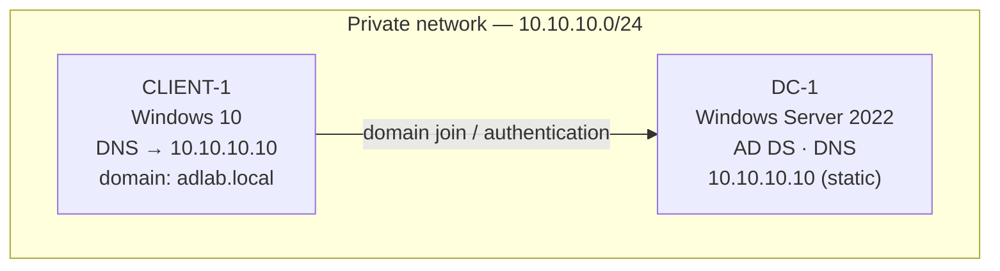
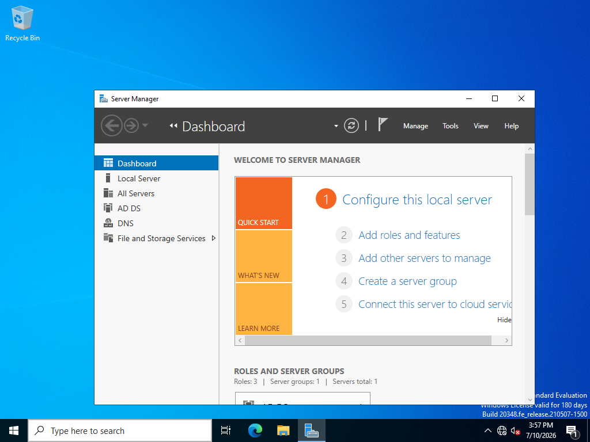
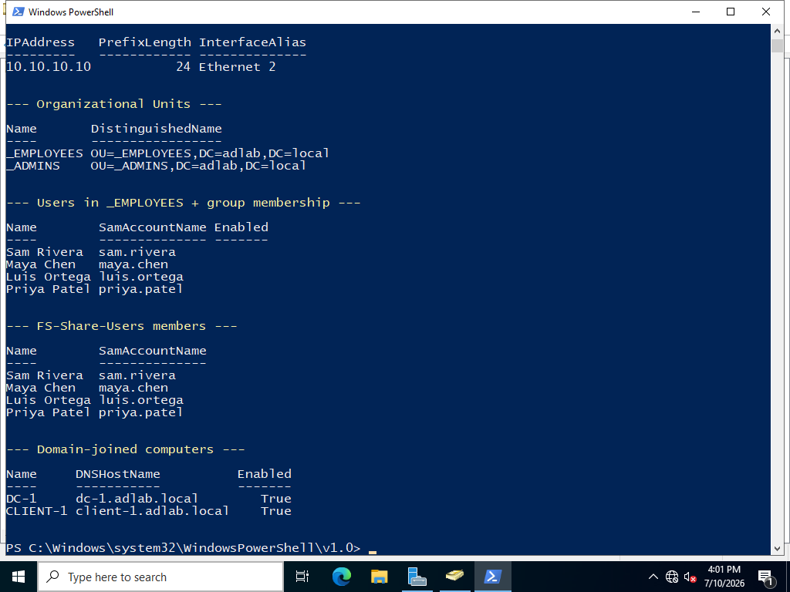
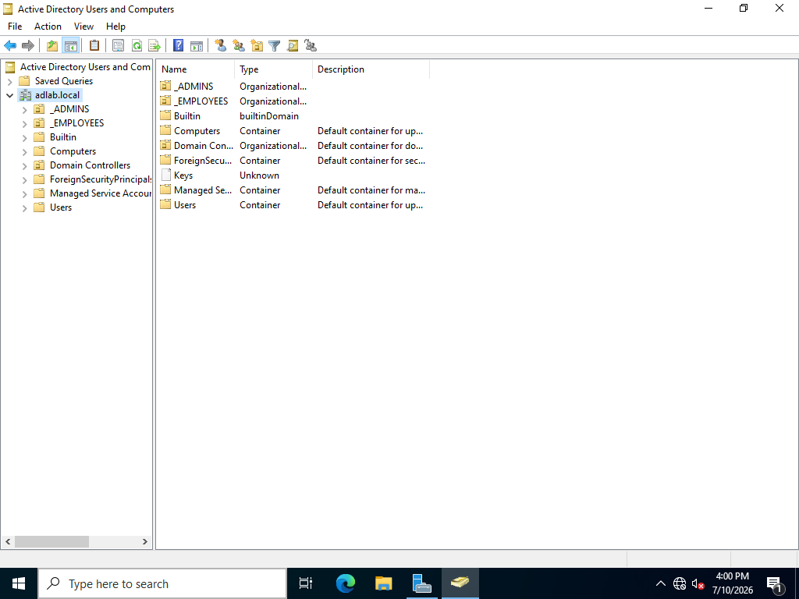
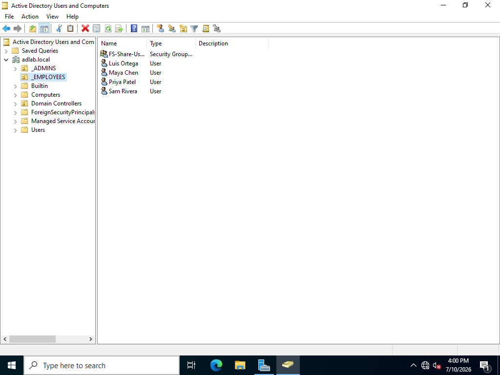
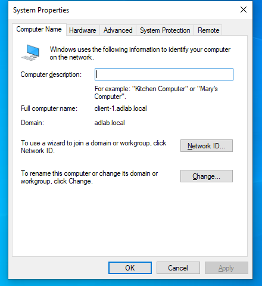
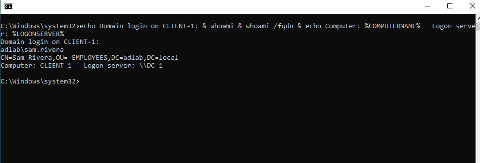

# On-premises Active Directory — Domain Controller, Domain Join, and Identity Management

This walkthrough builds a working Active Directory environment from scratch: a Windows Server 2022 domain controller and a Windows 10 client on a private network, standing up Active Directory Domain Services (AD DS), promoting the server to a domain controller, joining the client to the domain, and managing users and groups — then logging into the client with a domain account.

> The screenshots below are from a full build of this lab on a local hypervisor (Oracle VirtualBox on a Windows 11 host), with the two VMs on a private internal network. The original course lab provisions the same two machines as Azure VMs on a virtual network; the AD workflow — DC promotion, DNS, domain join, ADUC — is identical either way.

## Environments and Technologies Used

- Oracle VirtualBox (two VMs on a private internal network) — the course equivalent is Azure Virtual Machines on a virtual network
- Active Directory Domain Services (AD DS)
- DNS (installed with the domain controller)
- PowerShell (network config, role install, forest promotion, bulk user creation)

## Operating Systems Used

- Windows Server 2022 (domain controller — `DC-1`)
- Windows 10 (client — `CLIENT-1`)

## Lab Topology

Both VMs share a private network. The domain controller holds a static IP and runs DNS for the domain; the client uses the DC as its DNS server so it can locate and join the domain.

## Deployment and Configuration Steps

### 1. Provision the Domain Controller and Install AD DS

`DC-1` (Windows Server 2022) is given a **static IP** on the internal network (`10.10.10.10`) with its DNS pointed at itself, then the **Active Directory Domain Services** role is installed. Server Manager confirms the AD DS and DNS roles are present.

### 2. Promote to a Domain Controller (new forest)

The server is promoted to a domain controller for a new forest, **`adlab.local`**, which installs and configures DNS and reboots the machine as the domain's DC. The console below confirms the running domain, the static IP, the organizational units, the domain users, group membership, and both domain-joined computers:

### 3. Create Organizational Units, Users, and Groups

Two organizational units — **`_EMPLOYEES`** and **`_ADMINS`** — are created to organize accounts, alongside a **`FS-Share-Users`** security group. Active Directory Users and Computers (ADUC) shows the domain structure:

Four user accounts are created in `_EMPLOYEES` and added to the `FS-Share-Users` group (bulk-created with PowerShell). A separate admin account is placed in `_ADMINS` and granted Domain Admin membership:

### 4. Join the Client to the Domain

`CLIENT-1` (Windows 10) has its **DNS server set to the domain controller** (`10.10.10.10`) so it can resolve `adlab.local`, then it is joined to the domain. System Properties on the client confirms the full computer name `client-1.adlab.local` and domain membership:

Once joined, the client registers as a computer object in the domain, visible in ADUC on the DC:

### 5. Log In with a Domain Account

Finally, the client is signed into with a **domain user account** (`ADLAB\sam.rivera`) — created earlier on the DC — proving end-to-end authentication against the domain controller. `whoami` confirms the logged-in identity and domain group membership:

## Takeaways

This lab exercises the core workflow of a Windows domain environment: static addressing and the DNS dependency that AD relies on, installing AD DS and promoting a domain controller, organizing identities with OUs and groups, joining a client to the domain, and authenticating a domain user on that client — the same building blocks behind enterprise Windows networks.
